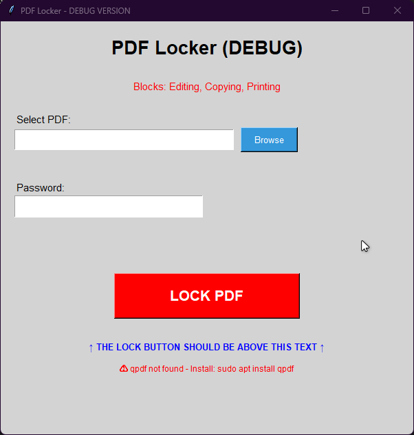

# PDF Locker 🔒

A simple, cross-platform GUI application to lock PDF files and prevent editing, copying, and printing. I created this tool for personal use going away with Adobe and other paid software. 
If you don't like it IDK lol


## Features

✅ **Block Editing** - Prevents all modifications to the PDF  
✅ **Block Copying** - Prevents text and image extraction  
✅ **Block Printing** - Completely blocks printing  
✅ **AES-256 Encryption** - Industry-standard encryption  
✅ **Cross-Platform** - Works on Linux and Windows  
✅ **Simple GUI** - Easy to use, no command-line required  

## Screenshots



## Installation

### Linux (Ubuntu/Debian/Mint)

```bash
# Install dependencies
sudo apt update
sudo apt install -y python3 qpdf python3-tk

# Clone the repository
git clone https://github.com/Bryan1tyts/PDF-Locker-using-QPDF.git
cd pdf-locker

# Make executable
chmod +x pdf-locker.py

# Run
python3 pdf-locker.py
```

### Windows

1. **Install Python 3**
   - Download from [python.org](https://www.python.org/downloads/)
   - ✅ Check "Add Python to PATH" during installation

2. **Install qpdf**
   - Download from [qpdf releases](https://github.com/qpdf/qpdf/releases)
   - Run the installer
   - Add to PATH or note installation location

3. **Run the application**
   ```bash
   python pdf-locker.py
   ```

## Usage

1. **Launch the application**
   ```bash
   python3 pdf-locker.py
   ```

2. **Select a PDF file**
   - Click the "Browse" button
   - Choose the PDF you want to lock

3. **Enter a password**
   - Type a password in the password field
   - ⚠️ Remember this password! You'll need it to unlock the PDF later

4. **Lock the PDF**
   - Click the "LOCK PDF" button
   - The locked PDF will be saved as `yourfile-LOCKED.pdf`

## Security Features

The application applies the following restrictions using qpdf:

- **Encryption**: AES-256 bit
- **User Password**: Empty (anyone can open the PDF)
- **Owner Password**: Required to remove restrictions
- **Permissions**:
  - ✅ Accessibility allowed (screen readers)
  - ❌ Editing blocked
  - ❌ Text/image extraction blocked
  - ❌ Printing blocked
  - ❌ Modifications blocked

## Technical Details

### Dependencies

- **Python 3.6+**
- **qpdf** - PDF manipulation tool
- **tkinter** - GUI framework (usually included with Python)

### How it works

The application uses `qpdf` with the following command structure:

```bash
qpdf --encrypt "" [password] 256 \
  --accessibility=y \
  --extract=n \
  --modify=none \
  --print=none \
  -- input.pdf output.pdf
```

### Limitations

⚠️ **Important**: PDF permissions are advisory, not absolute security. Some PDF readers may ignore these restrictions. For true security:

- Use a strong user password (requires password to open)
- Consider additional encryption methods
- Don't rely solely on PDF permissions for highly sensitive documents

## Troubleshooting

### "qpdf not found" error

**Linux:**
```bash
sudo apt install qpdf
```

**Windows:**
- Download qpdf from [GitHub releases](https://github.com/qpdf/qpdf/releases)
- Add qpdf to your system PATH

### "No module named 'tkinter'" error

**Linux:**
```bash
sudo apt install python3-tk
```

**Windows:**
- Tkinter comes with Python - reinstall Python with "tcl/tk and IDLE" option checked

### Can't see the "LOCK PDF" button

- Try maximizing the window
- Check if your display scaling is set to 100%
- Run from terminal to see debug output

## Contributing

Contributions are welcome! Please feel free to submit a Pull Request.

1. Fork the repository
2. Create your feature branch (`git checkout -b feature/AmazingFeature`)
3. Commit your changes (`git commit -m 'Add some AmazingFeature'`)
4. Push to the branch (`git push origin feature/AmazingFeature`)
5. Open a Pull Request

## Future Enhancements

- [ ] Add option to set user password (require password to open)
- [ ] Batch processing (lock multiple PDFs at once)
- [ ] Unlock/decrypt feature
- [ ] Custom permission presets
- [ ] Drag-and-drop support
- [ ] Command-line interface option

## License

This project is licensed under the MIT License - see the [LICENSE](LICENSE) file for details.

## Acknowledgments

- Built with [qpdf](https://github.com/qpdf/qpdf) - Amazing PDF manipulation tool
- Thanks to the Python tkinter community

## Author

Created by Bryan1tyts

## Support

If you find this useful, please ⭐ star the repository!

---

**Disclaimer**: This tool is provided as-is. Always test on non-critical documents first. PDF permissions are not foolproof security measures.
